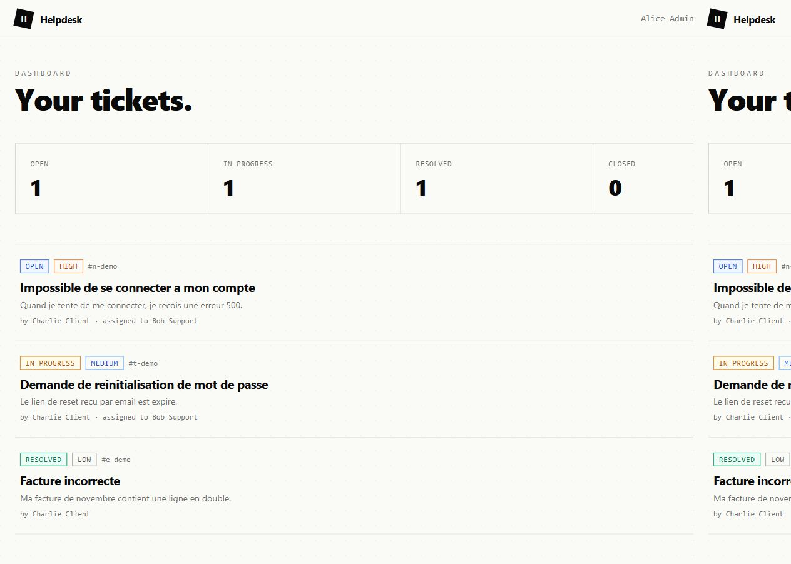
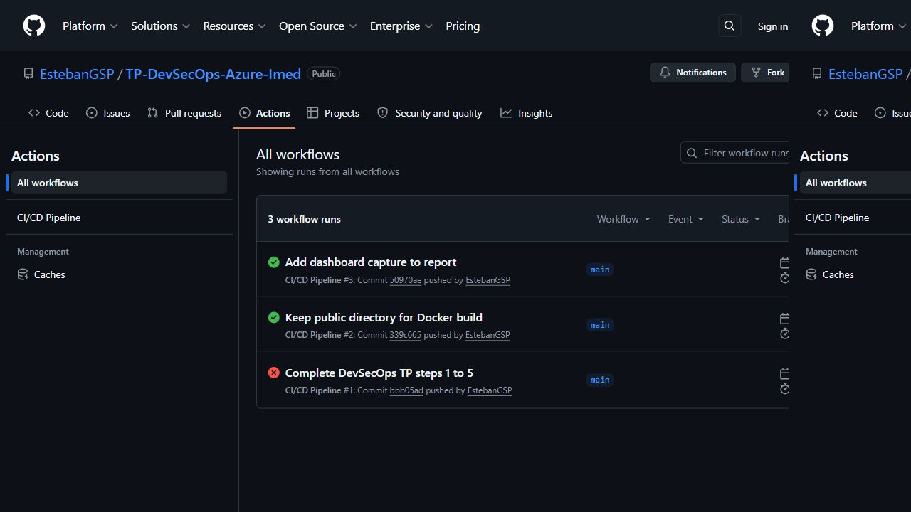

# Rapport TP DevSecOps - Helpdesk

## Contexte

Application support : `support-tickets`, application Next.js fullstack de gestion de tickets.

Etapes traitees dans ce rapport : conteneurisation Docker, tests unitaires, test de charge k6, securite, CI/CD GitHub Actions.

L'etape Azure n'est pas traitee pour l'instant car elle n'est pas encore obligatoire.

---

## Etape 1 - Conteneurisation Docker

### 1.1 Lecture du Dockerfile

**1. Pourquoi utilise-t-on un multi-stage build plutot qu'un seul `FROM` ?**

Un multi-stage build permet de separer l'environnement de compilation de l'environnement d'execution. Les dependances de build, le cache npm, TypeScript, ESLint et les fichiers sources complets restent dans les stages `deps` et `builder`. L'image finale `runner` ne contient que les artefacts necessaires pour lancer l'application. Resultat : image plus petite, surface d'attaque reduite, build plus propre.

**2. Que fait `output: 'standalone'` dans `next.config.js` ?**

`output: 'standalone'` demande a Next.js de produire un dossier `.next/standalone` avec le serveur Next.js et uniquement les dependances necessaires a l'execution. Le Dockerfile exploite ce dossier en copiant `.next/standalone`, `.next/static` et `public` dans l'image finale.

**3. Pourquoi creer un utilisateur `nextjs` non-root ?**

L'utilisateur non-root limite l'impact d'une compromission applicative. Si un attaquant exploite une faille dans l'application, il obtient les droits de l'utilisateur `nextjs`, pas ceux de `root` dans le conteneur.

**4. A quoi sert `HEALTHCHECK` ?**

`HEALTHCHECK` permet a Docker de verifier automatiquement si l'application repond encore. Ici, Docker appelle `/api/health`. Si l'endpoint ne repond plus, le conteneur passe en etat `unhealthy`, ce qui aide au diagnostic et a l'orchestration.

### 1.2 Build et execution

Commandes lancees :

```bash
docker build -t helpdesk:dev .
docker images helpdesk:dev
docker run -d -p 3010:3000 \
  -e DATABASE_URL=file:/app/data/prod.db \
  -e JWT_SECRET=test-secret-for-local-validation \
  --name helpdesk-container helpdesk:dev
curl http://localhost:3010/api/health
```

Resultats :

- Image Docker : `helpdesk:dev`
- Taille : `249MB`, donc inferieure a 300 Mo
- Endpoint health : `{"status":"ok", ...}`
- Login admin teste avec `admin@helpdesk.io / Password123!`

Note : le port local `3000` etait deja utilise sur ma machine. J'ai donc expose l'application sur `3010:3000` pour les validations locales.

Le conteneur initialise automatiquement la base SQLite au demarrage via `scripts/init-db.js`, afin de conserver une image finale legere sans embarquer toute la CLI Prisma.

### 1.3 Docker Compose

Commande prevue :

```bash
docker compose down -v
docker compose up -d --build
docker compose logs -f app
```

Point d'attention local : le fichier `docker-compose.yml` expose `3000:3000`. Si le port 3000 est deja occupe, il faut liberer le port ou temporairement modifier le mapping en `3010:3000`.

Capture dashboard :



---

## Etape 2 - Tests unitaires

### 2.1 Tests fournis

Commande :

```bash
npm test
```

Resultat :

```text
Test Files  3 passed (3)
Tests       24 passed (24)
```

### 2.2 Tests ajoutes

Ajouts realises :

- `src/lib/permissions.ts`
- `tests/unit/permissions.test.ts`
- Tests supplementaires dans `tests/unit/auth.test.ts`
- Tests supplementaires dans `tests/unit/validators.test.ts`

Tests ajoutes :

- token JWT expire rejete
- `loginSchema` accepte un login valide
- `loginSchema` rejette un mot de passe vide
- `ticketUpdateSchema` accepte une mise a jour partielle de statut
- `ticketUpdateSchema` accepte `assigneeId: null`
- `ticketUpdateSchema` rejette un statut invalide
- `canEditTicket` teste les cas ADMIN, USER auteur, USER non auteur, AGENT assigne, AGENT non assigne

### Couverture

Commande :

```bash
npm run test:coverage
```

Resultat :

```text
All files       | 79.68 | 90 | 71.42 | 79.68
auth.ts         | 80    | 100 | 80    | 80
permissions.ts  | 100   | 100 | 100   | 100
prisma.ts       | 0     | 0   | 0     | 0
validators.ts   | 100   | 100 | 100   | 100
```

La couverture n'est pas a 100 % car `prisma.ts` est un singleton de connexion base de donnees, non teste en unitaire. `auth.ts` n'est pas a 100 % car `getAuthFromRequest` n'est pas couvert par les tests actuels.

Capture a fournir : sortie console `npm run test:coverage`.

---

## Etape 3 - Tests de montee en charge avec k6

### 3.1 Smoke test

Commande :

```bash
k6 run -e BASE_URL=http://localhost:3010 k6/smoke-test.js
```

Resultat :

- 4680 requetes en 10 secondes
- 0 % d'erreur
- p95 : 3.66 ms
- seuils OK

### 3.2 Load test

Commande :

```bash
k6 run -e BASE_URL=http://localhost:3010 k6/load-test.js
```

Resultat mesure :

```text
Requests:      8059
Failed:        0.01%
p(95) latency: 3023 ms
avg latency:   755 ms
Iterations:    2686
RPS:           33.44
```

Interpretation :

- L'application reste disponible pendant le test de 50 VUs.
- Le taux d'erreur est quasi nul : `0.01 %`.
- Le p95 est trop eleve par rapport au seuil `p(95)<500ms`.
- Le point faible probable est SQLite + ecritures concurrentes lors de la creation de tickets.
- Le fichier `k6-summary.json` a ete genere a la racine du projet.

Capture a fournir : resume console k6 et/ou fichier `k6-summary.json`.

---

## Etape 4 - Securite

### 4.1 Audit des dependances

Commande :

```bash
npm audit --audit-level=high
```

Resultat :

- 11 vulnerabilites detectees
- 7 moderate
- 4 high

Principales dependances concernees :

- `next@14.2.33`
- `glob`
- chaine `vitest` / `vite` / `esbuild`
- `postcss`

Remediation proposee :

- mettre a jour Next.js vers une version corrigee compatible avec le projet
- mettre a jour `eslint-config-next`
- mettre a jour Vitest/Vite en validant les breaking changes
- relancer `npm audit` apres upgrade

### 4.2 Scan d'image Docker avec Trivy

Commande :

```bash
trivy image helpdesk:dev --severity HIGH,CRITICAL
```

Resultat :

- OS Alpine : 0 vulnerabilite HIGH/CRITICAL
- Dependances Node : vulnerabilites detectees, principalement sur `next@14.2.33`

Conclusion : l'image systeme est propre, mais les dependances applicatives doivent etre mises a jour.

### 4.3.1 JWT secret faible

Avec un secret faible connu, il est possible de forger un JWT si l'application accepte l'algorithme attendu et verifie uniquement la signature avec ce secret. En modifiant le payload pour passer `"role": "ADMIN"` puis en resignant avec le secret faible, un attaquant peut tenter d'appeler une route admin comme `DELETE /api/tickets/<id>`.

Dans cette application, la suppression exige `auth.role === 'ADMIN'`. Si le token forge est correctement signe avec le meme secret que le serveur, l'appel peut fonctionner.

Mitigations :

1. Utiliser un secret long, aleatoire et stocke hors du code, par exemple 32 octets minimum via GitHub Secrets / Azure Key Vault.
2. Mettre en place une rotation des secrets et une duree de vie courte des tokens.
3. Verrouiller les algorithmes acceptes cote verification JWT et eviter toute confusion d'algorithme.

### 4.3.2 Authorization bypass

Test propose :

```bash
TOKEN="<token user>"
curl -H "Authorization: Bearer $TOKEN" http://localhost:3010/api/tickets/<id-ticket-autre-user>
```

Observation code :

- `GET /api/tickets/[id]` retourne `403 Forbidden` si un USER consulte un ticket dont il n'est pas l'auteur.
- `PATCH /api/tickets/[id]` retourne aussi `403 Forbidden` dans ce cas.
- `DELETE /api/tickets/[id]` exige le role `ADMIN`.

Conclusion : le controle d'autorisation existe dans les routes ticket par id.

### 4.3.3 Headers de securite

Headers importants :

- `Content-Security-Policy`
- `X-Frame-Options`
- `Strict-Transport-Security`
- `X-Content-Type-Options`
- `Referrer-Policy`
- `Permissions-Policy`

Middleware ajoute dans `src/middleware.ts` :

```ts
import { NextResponse } from 'next/server';
import type { NextRequest } from 'next/server';

const securityHeaders = {
  'Content-Security-Policy': [
    "default-src 'self'",
    "script-src 'self' 'unsafe-inline' 'unsafe-eval'",
    "style-src 'self' 'unsafe-inline'",
    "img-src 'self' data:",
    "font-src 'self'",
    "connect-src 'self'",
    "frame-ancestors 'none'",
    "base-uri 'self'",
    "form-action 'self'",
  ].join('; '),
  'X-Frame-Options': 'DENY',
  'X-Content-Type-Options': 'nosniff',
  'Referrer-Policy': 'strict-origin-when-cross-origin',
  'Permissions-Policy': 'camera=(), microphone=(), geolocation=()',
  'Strict-Transport-Security': 'max-age=31536000; includeSubDomains',
};

export function middleware(request: NextRequest) {
  const response = NextResponse.next();

  for (const [key, value] of Object.entries(securityHeaders)) {
    response.headers.set(key, value);
  }

  return response;
}
```

---

## Etape 5 - CI/CD GitHub Actions

Workflow : `.github/workflows/ci-cd.yml`

Jobs :

- `test` : installation, Prisma generate, lint, tests avec couverture
- `security` : `npm audit`, Trivy filesystem scan
- `docker` : build image Docker + scan Trivy image
- `deploy` : prepare pour Azure, mais desactive tant que `ENABLE_AZURE_DEPLOY` n'est pas defini a `true`

Corrections realisees :

- ajout de `.eslintrc.json` pour eviter le prompt interactif de `next lint`
- ajout de `load: true` dans le build Docker GitHub Actions pour permettre le scan Trivy de l'image locale
- condition du job `deploy` modifiee pour ne pas echouer tant que l'etape Azure n'est pas activee

Validation locale :

```bash
npm test
npm run test:coverage
npm run lint
npm run build
docker build -t helpdesk:dev .
```

Resultats :

- tests : OK
- couverture : OK
- lint : OK avec warnings non bloquants
- build Next.js : OK
- image Docker : OK, `249MB`
- healthcheck conteneur : OK
- k6 smoke : OK
- k6 load : termine, mais seuil p95 depasse

Capture du workflow GitHub Actions vert :



---

## Synthese provisoire

Architecture jusqu'a l'etape 5 :

```text
Dev local
  |
  | git push
  v
GitHub repository
  |
  | GitHub Actions
  |-- test: lint + unit tests + coverage
  |-- security: npm audit + Trivy fs
  |-- docker: build image + Trivy image
  v
Image Docker helpdesk:dev validee localement
```

Ameliorations DevSecOps possibles :

1. Mettre a jour Next.js et les dependances vulnerables remontees par `npm audit` et Trivy.
2. Remplacer SQLite par PostgreSQL pour mieux tenir les ecritures concurrentes en charge.
3. Ajouter un vrai SAST type CodeQL ou SonarQube dans le pipeline.

Problemes rencontres :

- Port 3000 deja occupe localement : utilisation de `3010:3000`.
- Image Docker initiale superieure a 300 Mo : suppression des dependances Prisma inutiles dans le runner et initialisation DB par script leger.
- `next lint` interactif : ajout d'une configuration ESLint.
- k6 load test : l'application tient, mais la latence p95 depasse le seuil a 50 VUs.
